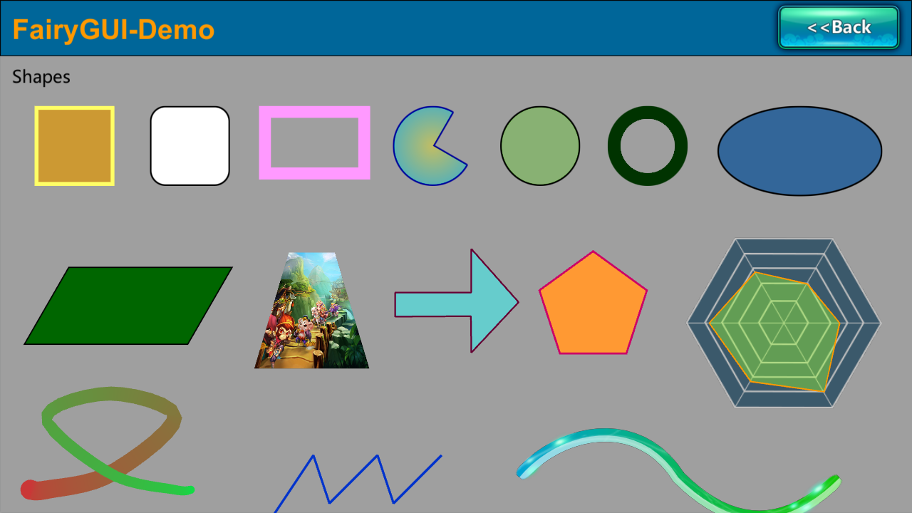

# FairyGUI for Unity3D

单独维护的 FairyGUI 运行时，基于版本 5.1.0，为特定渲染管线和编辑器版本做一些针对性调整，提升表现和效用

- 经过测试的编辑器版本：
    - Unity 2022.3.x
- 经过测试的平台：
    - Windows x64
- 渲染管线：内置和 SRP

获取设计器和原版运行库：[FairyGUI - 专业游戏 UI 解决方案](https://www.fairygui.com/)

## 兼容性

此包适配 `net standard 2.1` API.

改动和添加的部分使用了 `Span<T>`，如果要向更早的 Unity 版本移植，需要添加对应的类库。

部分功能需要 `Windows API`

## 改动清单

- 部分图形元件的实现替换为基于 SDF（有向距离场）的材质，见[距离场图元](#距离场图元)。
- 增加池化的 `StringBuilder`，替换运行时中临时构建的 `StringBuilder` 实例。
- 使用新的 C# 语言特性重新实现的 UBB 解析器，更清晰的解析步骤，更少的 GC。
- 增加一些扩展组件，见[扩展组件](#扩展组件)。
- 多分辨率适配增加限制缩放比下限选项，适应低分屏的场合。
- 字符超采样
- [施工中]

### 改进的内部实现

#### 距离场图元

部分图形元件改为使用基于 SDF（有向距离场）的材质，它们总是生成四边形网格。着色器兼容 SRP-Batching，在着色器内实现抗锯齿。

- 矩形（含圆角矩形，可选描边）
- 圆形（含椭圆，可选描边，可选扇形填充，可选中心颜色）

__特别设置__：可为图形设置特别的名称前缀，以应用特定的 SDF 选项：

- `nosdf-` 强制此图形不使用 SDF，在应用于遮罩时使用。由于目前的实现无法使距离场材质正确用于遮罩，组件初始化阶段也会检查图形使用的图元。
- `sdfshadow-` 声明此图形使用 SDF 并应用软边缘。只有适配 SDF 材质的图元才会识别这个前缀，可用于模拟阴影或者其它需要软边缘图元的场合。

__注意__：可通过 `Shape.UseSDFShape` 静态属性查询是否在全局启用了距离场图元，或者通过 `Shape.isSDFShape` 实例属性查询特定形状是否为距离场图元。如果启用了距离场图元，调用 `shape.graphics.GetMeshFactory<T>()` 更改图元网格时要使用 SDF 版本的 `IMeshFactory` 实现。

下图分别为使用距离场描述的图元和使用顶点描述的图元的视觉表现。多边形外观一致，曲线边缘更柔和，未修改贝塞尔曲线/折线/轨迹线的实现。

图元的中心和边缘颜色不同时和原有实现有色差。

#### UI 缩放比下限

FairyGUI 内置的 `UIContentScaler` 可以选择如何适配多种分辨率，对实际使用的分辨率大于设计稿时使用缩放策略（适应宽高）更优，反过来则是固定 Dpi 更优。在 `UIConfig` 中增加了 `MinScaleFactor` 选项，可以设置缩放比最小值，使全局缩放比调整后额外钳制到最小值以上。

#### 字符超采样

用于缓解小字符显示效果不佳。Unity 内缺省对字符使用灰度抗锯齿，绘制小字符时会出现亚像素问题，超采样发生在获取字符位图时，按照原本的字体像素大小获取更大的位图，相当于为字符执行了一次激进但不准确的笔画微调。改动发生在 `DynamicFont.cs`，使用文件内的宏控制功能开启。

### 新组件

一些实用的自定义组件。

#### 虚拟树视图

类型为 `FairyGUI.Extensions.VirtualTreeView`，在 FGUI 编辑器中制作时需要制作一个树状列表，在把树状列表装入一个组件中，在项目脚本绑定扩展类。

需要使用特定的数据节点，通过数据节点中的属性直接控制列表项的展开/折叠和选中

#### 弹出菜单

分为弹出菜单的环境（对象池和生成菜单的基础行为）和可拼接的菜单定义，行为表现类似 Windows 的菜单。

简单起见，弹出菜单的列表没有虚拟化。

见：
- `FairyGUI.Extensions.PopupMenuEnvironment`
- `FairyGUI.Extensions.PopupMenuBuilder`

#### 数字输入框

继承按钮，包含一个接受拖拽的区域，可以通过横向拖拽改变值。内置了读写整数和浮点数值的行为，和四则运算表达式的计算器。

- 对整数和浮点数（有限精度）使用最简单的格式化，运行期不分配额外的对象
    - 使用不安全的字符缓冲区对象，见 `FairyGUI.Foundations.Number.IntegerStringInstance` 和 `FairyGUI.Foundations.Number.FloatStringInstance`
- 按钮组件简单地设置扩展类到此类即可，组件的 `title` 需要是输入文本
- 可选增加名为 `handle` 的图形元件作为横向拖拽改变数字值的区域，设置为完全透明的矩形
    - 如果 `Windows API` 可用，则拖拽光标到屏幕一侧时可以使光标从另一侧出现
- 如果需要 `Label` 等组件用于数字输入，见 `FairyGUI.Extensions.NumberInputObject` 类的注释
- 数字输入框支持输入简单四则运算表达式，见 `FairyGUI.Foundations.Arithmetic.ArithmeticUtil`
- 如果只需要单纯显示数字，可以为普通的文本框的 `text` 属性赋予前述的不安全的字符缓冲区对象，并保留此缓冲区的引用，具体用法见 `FairyGUI.Extensions.NumberInputObject.Value` 的源代码 

// 施工中

## 一些结论

- 颜色空间
  - FairyGUI 缺省使用 Gamma 颜色空间，导出结果可靠（在 Unity 内使用线性颜色空间的呈现效果和 UGUI 接近）。
- 绘制字符
  - 绘制小型字符（<= 16 px）直接使用字体文件比图片或者 TextMeshPro 方案更好，原因是前者附带 Hint 调整了笔画位置和数量。
  - 在线性空间下绘制小型字符最好使用更高饱和度的颜色，因为灰度抗锯齿的关系实际的呈现效果看起来的饱和度会较低。
  - 所有在 Unity 内直接绘制字符的方案在呈现小型字符时效果都不理想。
    - 由于仅使用灰度抗锯齿，在 Unity 内直接绘制字体的各种方案表现都不算出色。
    - 对桌面端使用的常见字号（12，16，24 px），直接使用 ttf/otf 字体视觉效果可能更佳。
- [施工中]
